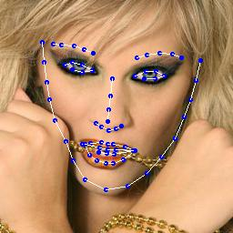
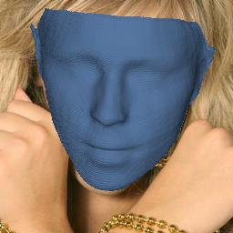

# PRN
## Notice
This repository is only a re-implementation of 《Joint 3D Face Reconstruction and Dense Alignment with Position Map Regression Network》.
If you use this code, please observe the license of [PRNet](https://github.com/YadiraF/PRNet) and [3DDFA](https://github.com/mmatl/pyrender).
Please make sure that this code is only used for research and non-commercial purposes.
I hope this re-implementation can help you.
## Requirements:
    python 3.6.9
    opencv-python 4.1
    pillow 6.1
    pyrender 0.1.32
    pytorch 1.1.0
    scikit-image 0.15.0
    scikit-learn 0.21.3
    scipy 1.3.1
    tensorboard 2.0.0
    torchvision 0.3.0
    
## Getting started
1. Please refer to [face3d](https://github.com/dd-dos/face3d/tree/master/examples/Data/BFM) to prepare BFM data. And move the generated files in Out/
 to data/Out/  
**Editor note**: Simply run `dvc pull` if you are strong enough.

2. Download databases from [3DDFA](http://www.cbsr.ia.ac.cn/users/xiangyuzhu/projects/3DDFA/main.htm). Put the raw dataset in data/images (e.g. 
data/images/AFLW2000):
- AFLW2000: `wget http://www.cbsr.ia.ac.cn/users/xiangyuzhu/projects/3DDFA/Database/AFLW2000-3D.zip`.
- 300WLP: create a shortcut from [300WLP](https://drive.google.com/file/d/0B7OEHD3T4eCkVGs0TkhUWFN6N1k/view) to your Google Drive, then use rclone.

3. (maybe) You have to compile Cython module before running `processor.py`: 
- `cd utils/faceutil/mesh/cython`.
- `python3 setup.py build_ext --inplace`.

4. Run processor.py to generate UV position maps. I recommend you to use the following instructions:
```cmd
python processor.py -i=data/images/AFLW2000 -o=data/images/AFLW2000-crop -f=True -v=True --isOldKpt=True
python processor.py -i=data/images/300W_LP -o=data/images/300W_LP-crop --thread=16

```
It takes about 2-4 hours depending on your working machine.

5. Train PRNet (adjust argument if needed):
```cmd
sh scripts/train.sh

```

6. Inference: In progress. Stay tuned.

Result examples:



